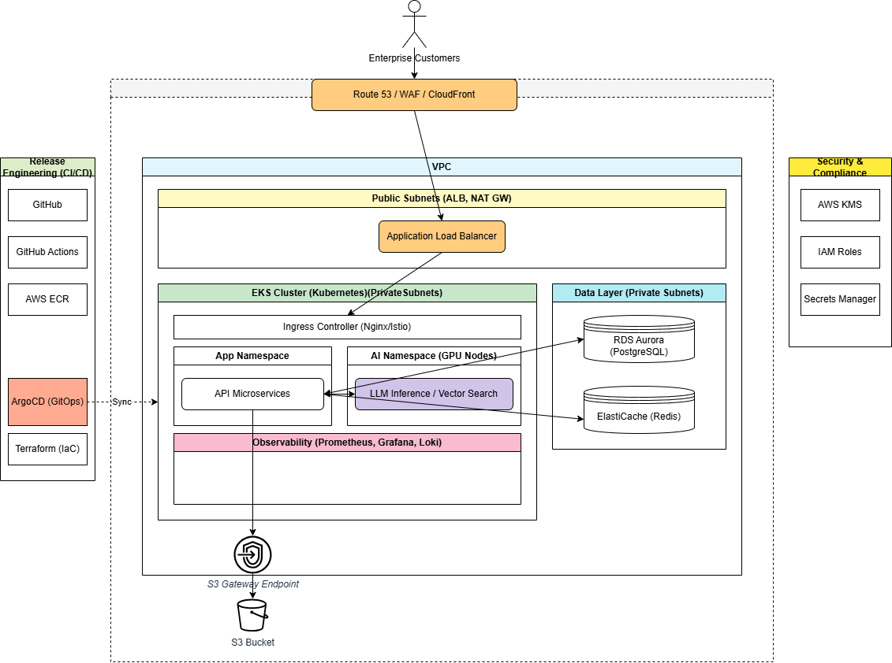

# Architecture Analysis and Gap Assessment

## Current Architecture Overview

Based on the existing architecture diagram, the platform demonstrates a solid foundation with the following components:

### Existing Components

#### Edge and Entry Layer
- **Route 53 / WAF / CloudFront**: DNS, security, and CDN services
- **Application Load Balancer (ALB)**: Load balancing in public subnets
- **Enterprise Customers**: External user access point

#### Network Architecture
- **VPC**: Single region deployment
- **Public Subnets**: ALB and NAT Gateway placement
- **Private Subnets**: EKS cluster and data layer isolation

#### Compute Layer (EKS Cluster)
- **Ingress Controller**: Nginx/Istio for traffic routing
- **App Namespace**: API microservices deployment
- **AI Namespace**: GPU nodes for LLM inference and vector search
- **Observability Namespace**: Prometheus, Grafana, Loki stack

#### Data Layer
- **RDS Aurora PostgreSQL**: Primary database
- **ElastiCache Redis**: Caching and session storage
- **S3 Bucket**: Object storage with VPC endpoint

#### Release Engineering
- **GitHub**: Source code management
- **GitHub Actions**: CI/CD automation
- **AWS ECR**: Container registry
- **ArgoCD**: GitOps deployment
- **Terraform**: Infrastructure as Code

#### Security Components
- **AWS KMS**: Key management (shown in diagram)
- **IAM Roles**: Access management
- **Secrets Manager**: Secrets management

## Architecture Strengths

1. **Cloud-Native Design**: Proper use of AWS managed services
2. **Microservices Architecture**: Separated namespaces for different workloads
3. **GitOps Approach**: ArgoCD for deployment automation
4. **Observability Foundation**: Prometheus/Grafana/Loki stack
5. **AI/ML Ready**: Dedicated GPU nodes for AI workloads
6. **Network Isolation**: Proper subnet segregation

---

## Multi-Tenancy Strategy

- Namespace-based isolation
- Resource quotas per tenant
- Optional dedicated node pools for premium tenants

---

## Scalability Strategy

- Horizontal Pod Autoscaler (HPA)
- Cluster Autoscaler for node scaling